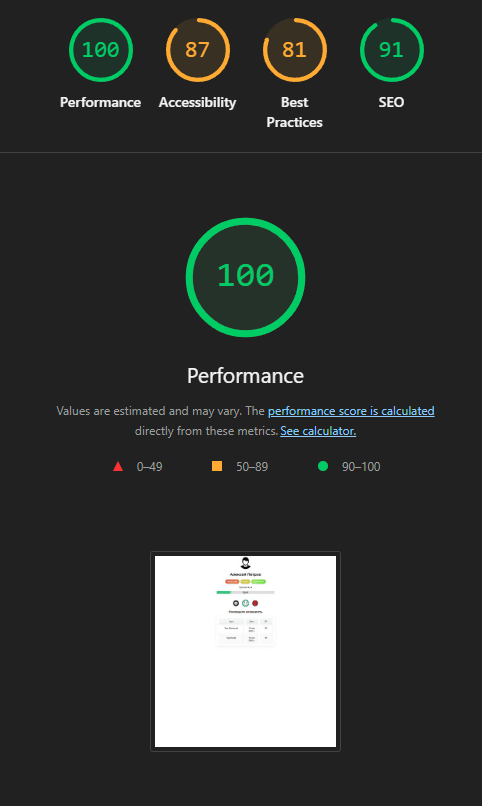
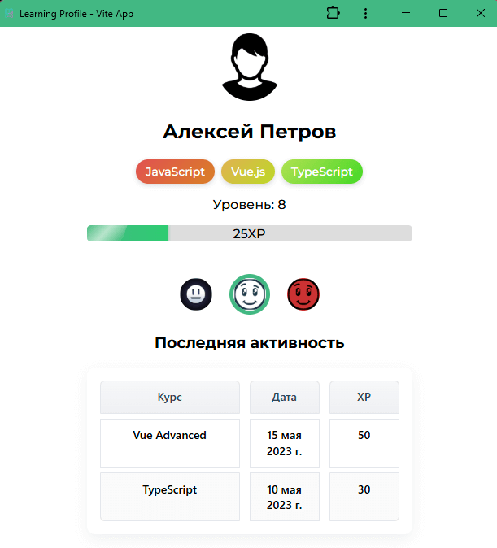

# Learning Profile — Vue 3 PWA
*(RU | EN)*

[🔗 Демо | Live demo](https://den-dev97.github.io/learning-profile/)

<p align="center">
  
  
</p>

---

## 📋 Описание / Description

### RU
**Learning Profile** — небольшое прогрессивное веб-приложение для геймифицированного учёта обучения.
* Пользователь видит свой уровень, текущее XP и прогресс до следующего уровня.
* Список завершённых курсов с датами и начислениями XP хранится в Pinia-сторе.
* За достижение порогов (1-10 ур., 10-50 ур. и т.д.) выдают «ачивки» — значки, которые подсвечиваются зелёной рамкой, когда уровень попадает в диапазон.
* Приложение устанавливается на телефон/ПК (PWA) и работает офлайн: манифест, Service Worker, экран установки.
* UI адаптивный: CSS Grid + Flexbox, плавные анимации `<Transition>`.

### EN
**Learning Profile** is a small progressive-web app that gamifies your learning stats.
* The user sees their **level**, current **XP** and progress to the next level.
* A list of completed courses with dates and awarded XP is stored in a Pinia store.
* Crossing XP ranges (1-10, 10-50, …) unlocks **achievements** — badges get a green highlight when active.
* The app can be **installed** as a PWA and works **offline** thanks to a manifest + Service Worker.
* Responsive UI built with CSS Grid/Flexbox and Vue `<Transition>` animations.

---

## 🚀 Быстрый старт / Quick start

```bash
git clone https://github.com/den-dev97/learning-profile.git
cd learning-profile
npm install
npm run dev      # режим разработки / dev-server
npm run build    # production сборка / production build
